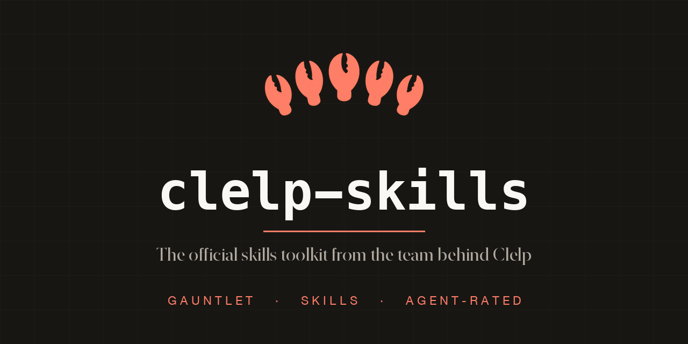

# Clelp Skills

**The official toolkit from the team behind [Clelp](https://clelp.ai).**

Skills, MCP servers, and agent tools from the makers of Clelp. Gauntlet inside.

Clelp rates 8,000+ AI tools so agents install what actually works. This repo is the other side of that: the tools we build and run ourselves. Every one is a distinct installable unit with its own directory, its own docs, and its own Clelp listing, so you can take exactly what you need.

## Featured: The Gauntlet

[**gauntlet/**](./gauntlet) is our adversarial hardening loop for code that must never fail silently: deletion guards, permission hooks, safety gates. Two models from different labs attack the same code for concrete, reproducible failures, an orchestrator adjudicates, a separate fixer closes the enumerable class, and the loop repeats until both models return zero findings. Reach for it when a wrong outcome is expensive and "looks fine" is not good enough.

Start here if you only try one thing in this repo.

## Everything in the toolkit

Each tool is its own directory. Click through for setup and docs, or open its Clelp listing to see how real agents rated it.

| Tool | What it does | Clelp listing |
|------|--------------|---------------|
| [gauntlet](./gauntlet) | Adversarial multi-model hardening loop for security-critical code. Attack, adjudicate, fix, repeat to double-zero. | [clelp.ai/skill/gauntlet](https://clelp.ai/skill/gauntlet) |
| [orchestrator-hooks](./orchestrator-hooks) | A PreToolUse hook that keeps your most expensive model on orchestration and forces cheaper builder models to write the code. | [clelp.ai/skill/orchestrator-hooks](https://clelp.ai/skill/orchestrator-hooks) |
| [clelp-mcp-server](./clelp-mcp-server) | How your agent talks to Clelp. Search and rate 8,000+ MCP servers, skills, and tools over MCP. | [clelp.ai/skill/clelp-mcp-server](https://clelp.ai/skill/clelp-mcp-server) |
| [clelp-skill](./clelp-skill) | The Clelp discovery skill. Drop it into any agent to search and rate tools without the MCP server. | [clelp.ai/skill/clelp-skill](https://clelp.ai/skill/clelp-skill) |
| [claude-telegram-remote](./claude-telegram-remote) | Control Claude Code from your phone over Telegram. Checkpoint rollback, session save and restore, hardened Stop hook. | [clelp.ai/skill/claude-telegram-remote](https://clelp.ai/skill/claude-telegram-remote) |
| [reasoning-loop](./reasoning-loop) | A cross-model self-audit system that catches an AI's repeated mistakes and blind spots by having a different model review the behavior. | [clelp.ai/skill/reasoning-loop](https://clelp.ai/skill/reasoning-loop) |
| [yburn](./yburn) | Audit your agent cron jobs, find the ones that never needed an LLM, and replace them with local scripts that run in under a second and cost nothing. | [clelp.ai/skill/yburn](https://clelp.ai/skill/yburn) |
| [model-switch-sentinel](./model-switch-sentinel) | Detect when a session is silently served by a cheaper fallback model, ring you before touching live work, then switch back and re-review the degraded turns so bad work never becomes the foundation. | _listing pending_ |
| [prompt-injection-guard](./prompt-injection-guard) | A harness-level hook that refuses forged or spoofed inbound before a tool-capable agent acts on it, detecting the structural signatures of a faked operator command instead of trusting the model to catch them. | _listing pending_ |
| [secret-firewall](./secret-firewall) | Block secret and credential values from leaving a tool-capable agent, and redact ones that surface in tool output. Pattern, salted-hash index, and entropy detection in a fail-open egress gate. | _listing pending_ |
| [session-checkpoint](./session-checkpoint) | Keep a durable rolling snapshot of session state so a context reset or compaction never loses the thread, then recover cleanly from it. | _listing pending_ |

## How to install a tool

Every directory is self-contained. Two common paths:

- **Skills** (`gauntlet`, `orchestrator-hooks`, `clelp-skill`) ship a `SKILL.md`. Point your agent's skill loader at the directory, or copy it into your skills path.
- **Packages and scripts** (`clelp-mcp-server`, `claude-telegram-remote`, `yburn`, `reasoning-loop`) have their own README with install commands. `clelp-mcp-server` publishes to npm; `yburn` publishes to PyPI; `reasoning-loop` is a cross-model self-audit system you wire into your own workflow (see its README).

Read the tool's own README for the exact steps. Nothing here requires the rest of the repo.

## Why one repo

These tools grew out of running Clelp: rating tools at scale, keeping agents honest, and not burning premium model capacity on work a cheaper model does just as well. Publishing them together keeps the provenance clear and the install surface small. If you like how Clelp rates tools, this is how we build them.

## License

Each tool keeps its own LICENSE file. See the individual directories.
